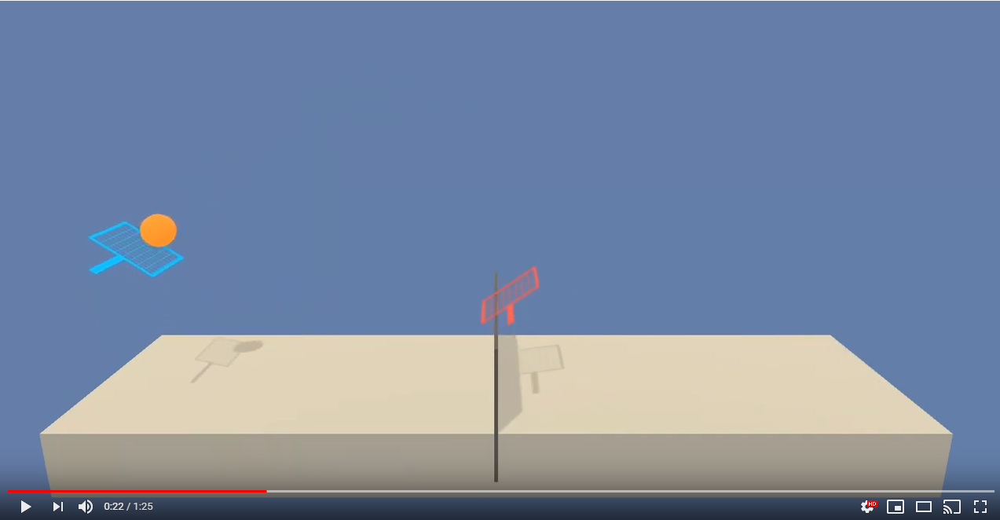

# Report of the project

### Table of Contents

1. [Introduction](#introduction)
2. [Learning Algorithm](#LA)
3. [Hyperparameters](#hyper)
4. [Results](#Results)
5. [Results Video](#ResultsVideo)
6. [Next Steps](#NextSteps)

## Introduction 

In this environment, two agents control rackets to bounce a ball over a net. If an agent hits the ball over the net, it receives a reward of +0.1. If an agent lets a ball hit the ground or hits the ball out of bounds, it receives a reward of -0.01. Thus, the goal of each agent is to keep the ball in play.

The observation space consists of 8 variables corresponding to the position and velocity of the ball and racket. Each agent receives its own, local observation. Two continuous actions are available, corresponding to moves toward (or away from) the net, and jumping.

The task is episodic, and in order to solve the environment, your agents must get an average score of +0.5 (over 100 consecutive episodes, after taking the maximum over both agents). Specifically,

After each episode, we add up the rewards that each agent received (without discounting), to get a score for each agent. This yields 2 (potentially different) scores. We then take the maximum of these 2 scores.
This yields a single score for each episode.
The environment is considered solved when the average (over 100 episodes) of those scores is at least +0.5.

## Learning Algorithm 

The algorithm I used for this project is the Multi-Agent DDPG Actor Critic Model ([paper](https://deepmind.com/research/publications/continuous-control-deep-reinforcement-learning)).

In order to explain this algorithm, first, it needs to know that there are two ways for estimating expected returns. First is the Monte Carlo estimate, which roles out an episode in calculating the discounter total reward from the rewards sequence. In Dynamic Programming, the Markov Decision Process (MDP) is solved by using value iteration and policy iteration. Both techniques require transition and reward probabilities to find the optimal policy. When the transition and reward probabilities are unknown, we use the Monte Carlo method to solve MDP. The Monte Carlo method requires only sample sequences of states, actions, and rewards. Monte Carlo methods are applied only to the episodic tasks.

We can approach the Monte — Carlo estimate by considering that the Agent play in episode A. We start in state St and take action At. Based on the process the Agent transits to state St+1. From environment, the Agent receives the reward Rt+1. This process can be continued until the Agent reaches the end of the episode. The Agent can take part also in other episodes like B, C, and D. Some of those episodes will have trajectories that go through the same states, which influences that the value function is computed as average of estimates. Estimates for a state can vary across episodes so the Monte Carlo estimates will have high variance.

Also, we can apply the Temporal Difference estimate. TD approximates the current estimate based on the previously learned estimate, which is also called bootstrapping. TD error are the difference between the actual reward and the expected reward multiplied by the learning raw. TD estimates are low variance because you’re only compounding a single time step of randomness instead of a full rollout like in Monte Carlo estimate. However, due to applying a bootstrapping (dynamic programming) the next state is only estimated. Estimated values introduce bias into our calculations. The agent will learn faster, but the converging problems can occur.

Deriving the Actor-Critic concept requires to consider first the policy-based approach (AGENT). As we discussed before the Agent playing the game increases the probability of actions that lead to a win, and decrease the probability of actions that lead to losses. However, such process is cumbersome due to lot of data to approach the optimal policy.

It can evaluate the value-based approach (CRITIC), where the guesses are performed on-the-fly, throughout all the episode. At the beginning our guesses will be misaligned. But over time, when we capture more experience, we will be able to make solid guesses. 

Based on this short analysis we can summarize that the Agent using policy-based approach is learning to act (agent learns by interacting with environment and adjusts the probabilities of good and bad actions, while in a value-based approach, the agent is learning to estimate states and actions.) . In parallel we use a Critic, which is to be able to evaluate the quality of actions more quickly (proper action or not) and speed up learning. Actor-critic method is more stable than value-based agents.

As a result of merge Actor-Critic we utilize two separate neural networks. The role of the Actor network is to determine the best actions (from probability distribution) in the state by tuning the parameter θ (weights). The Critic by computing the temporal difference error TD (estimating expected returns), evaluates the action generated by the Actor.

## Hyperparameters 
The Parameters used for the Agent are:

| Hyperparameter  | value |
| ------------- | ------------- |
| Replay Buffer Size  | 1e6  |
| Minibatch Size  | 128 |
| Discount Rate  | 0.99  |
| TAU  | 9e-3  |
| Actor Learning Rate  | 0.0001  |
| Critic Learning Rate  | 0.0001  |
| Neurons Actor Network Layer 1 | 128  |
| Neurons Actor Network Layer 2 | 64  |
| Neurons Critic Network Layer 1 | 128  |
| Neurons Critic Network Layer 2 | 64  |

## Results DDGP 
Two tests have been carried out to analyse how far the model could go. The first one (Approach 1) has been carried out to solve the objectives proposed by the exercise: To reach 0.5 of reward in 100 consecutive episodes. The second proposed approach is for the implementation to achieve 2 target scores on average over the previous 100 episodes. It has been proven that once the initial target score of 0.5 is reached, the agent quickly stabilizes the learning process, which makes it reach 2 target scores on average very quickly. 

### First Approach (Average target score of 0.5)
The environment is solved in 2271 episodes. This number may seem high, but analyzing the curves in which the learning of the model can be appreciated, it can be seen how almost from the first episodes the model manages to learn. It has been observed that in the episodes where there is no reward, the agent is not able to start the game, failing to serve, so the reward quickly drops for these scenarios. The models has been saved with {0.5} sufix. 

### Second Approach (Average target score of 2.0)
The next test (approach 2) as to leave the agents learning until they achieved an average score of 2 for 100 consecutive episodes. It has reached this result in 2517 episodes. The models has been saved with {2.0} sufix. As explained in the previous point, once the agents manage to chain several plays in the game, they are able to learn much faster.  

## Video of the agents 
In order to analyse and see the behaviour of our trained models, a video has been uploaded on youtube where you can see and analyse the performance of our trained models. 
([Link youtube](https://www.youtube.com/watch?v=2bYh-Q7lcWk&ab_channel=FernandoDR)).

## Next Steps 
The algorithm is improvable, and it is possible to make different improvements that can improve the results and speed up the training process. Some of them are: 
1)	Optimize the hyperparameters of the process and network by using other strategies like random search, hyperband, Bayesian optimization.
2)	Change the network architecture replacing the ANN with other architectures (LSTM, CNN, Transformers, …).  
3)	Test other algortithms like A3C, TD3, PPO.
4)	Add prioritized replay.
5)	Contenarise the proposed approach using Docker to improve the portability and scalability of the code. It is possible to create a docker container instead of a conda env to share the code and notebooks without manually installing any dependencies. 
6)	Once the application is containerised, we can implement it using Kubeflow to put them into production and scale it depending on the needs of the problems. Additionally, we can train our networks using different workers in a distributed way. The amount of workers depends on the time we want to solve the problem, taking into account that while more speed trains the algorithm, more hardware is using, and hence, the cost of training the agent could increase. Using Kubeflow, we can implement Katib to found the best combination of hyperparameters and transform the code focusing on futher production applications. 

